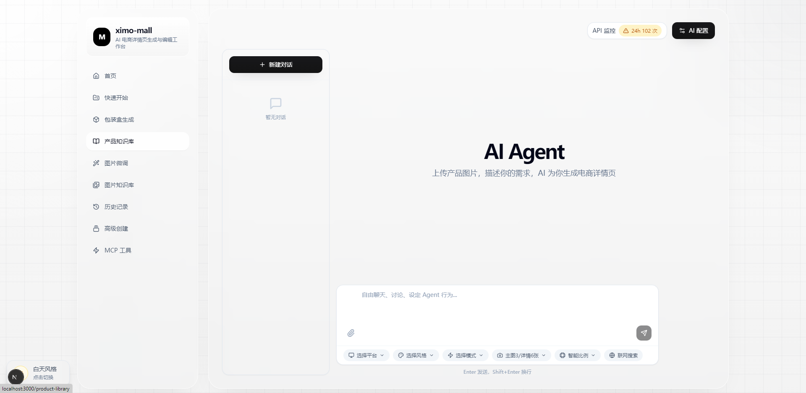

# Ximo Mall

**AI 电商详情页生成与编辑工作台**

> 本项目基于 [banana-mall](https://github.com/) 二次开发，在原项目基础上进行了品牌更名、主图硬约束体系升级、风格差异化增强、文字准确性强化等改进。
>
> This project is a secondary development based on [banana-mall](https://github.com/), with brand renaming, hero image hard-constraint system upgrades, style differentiation enhancements, text accuracy reinforcement, and other improvements.



---

## 中文说明

### 项目简介

Ximo Mall 是一款 AI 驱动的电商详情页自动生成与编辑工具。用户只需上传商品图片，AI 即可自动完成商品分析、文案规划、图片生成全流程，输出可直接用于电商平台的高质量详情页。

支持 5 大电商平台、20 种视觉风格、10 项主图硬约束，通过 AI Agent 对话式交互实现"一句话生成详情页"。

### 核心功能

#### 1. AI Agent 对话式生成

基于 Mastra 框架的 AI Agent，调度 7 个专用工具自动执行 5 步流程：创建项目 → 联网搜索 → 文案规划 → 图片生成 → 结果汇报。支持自动模式（一键全流程）和问答模式（逐步确认）。支持平台、风格、模式、头图张数、联网搜索等前端选择器。模型深度思考链路实时展示在前端，工具调用过程可视化。

#### 2. 20 种视觉风格

5 大风格分类，20 种差异化视觉风格：

| 分类 | 风格 |
|------|------|
| **摄影写实** | 极简主义、浓郁食欲/街潮、真实诱人美食摄影、日系清新/文艺、精修产品/高端质感、健康/轻食代餐 |
| **插画艺术** | 国潮插画、复古中国风、创意手绘/涂鸦、憨萌卡通/童趣 |
| **促销营销** | 节日促销/大促氛围 |
| **场景叙事** | 温暖家常/亲民、地域风情/城市记忆、简约实景/生活化场景、母婴亲子/宝宝辅食 |
| **概念创意** | 意境山水/水墨、现代信息图表、C4D/3D 立体、参数化/科技几何、动态/短视频风格 |

风格只决定视觉表现形式（颜色/字体/材质/形状/布局位置），不删减元素数量或留白。同一种产品在不同风格下，硬约束元素类别完全一致，但视觉呈现截然不同。

#### 3. 产品知识库

用户可自由创建产品条目，上传多张产品图片。AI 逐张分析提取产品核心信息，自动拆分为知识条目（使用场景、核心卖点、产品规格、材质、目标人群、品牌信息等）。选择知识库后，全链路强制约束卖点/规格/场景等事实性内容来自知识库，确保 AI 不脱离事实。

#### 4. 商品 AI 分析

AI 分析商品图片，提取商品名称、类目、材质、核心卖点、目标人群画像、使用场景、口味/风味特征、视觉关键词等结构化信息。

#### 5. 文案规划

基于商品分析结果，AI 规划详情页各个模块的文案和视觉方向。支持头图主视觉、卖点模块、场景展示、细节特写、规格参数、材质工艺、对比说明、送礼场景、品牌信任、总结收口共 10 种模块类型。

#### 6. 图像生成

AI 根据规划和文案生成详情页各模块图片。所有风格统一执行高密度饱满标准，画面无大面积留白。内置文字准确性规则，减少生成图中的错别字。

#### 7. 图片精调

对已生成的图片进行 AI 精调/编辑：整体重绘/增强、定向微调/P 图、图片超分高清放大。

#### 8. 编辑器工作台

可视化编辑详情页各模块的文案、视觉提示词、图片，支持版本管理和参考图选择。

#### 9. AI 学习系统

用户投喂商品图片，AI 学习风格、配色、布局、文案等知识，用于增强后续生成效果。包含完整的学习 → 审查 → 应用工作流。

#### 10. 图片库

集中管理所有上传的图片资产，支持分类、标签、集合、搜索、统计。

#### 11. Provider 管理

配置 AI 服务提供商（OpenAI 兼容 API），自动发现模型列表，自动检测模型能力，模型角色分配，连接测试，API Key 加密存储。

#### 12. MCP Server

标准 MCP (Model Context Protocol) Server，允许 Claude Desktop、Cursor 等外部 AI 工具通过标准协议调用 Ximo Mall 功能。支持 stdio 和 HTTP 两种传输方式，内置 Web UI 控制台。

#### 13. 外部 Agent API

面向本地/内网外部应用的标准化 API，标准 SSE 格式，支持纯文本 + 图片输入，提供 TypeScript 和 Python 连接器示例。

#### 14. 导出

将生成的详情页导出为图片或 JSON 结构数据。

#### 15. API 用量监控

记录和展示 API 调用量、Token 消耗等使用指标。

#### 16. Electron 桌面端

Windows 桌面应用，内置 Next.js 服务自动启动，支持 NSIS 安装包和绿色免安装版。

### 技术栈

| 层级 | 技术 |
|------|------|
| **前端** | Next.js 15.5.7 + React 18 + TypeScript + Tailwind CSS + Radix UI |
| **后端** | Next.js API Routes + Prisma (SQLite) |
| **AI 框架** | Mastra Agent + @ai-sdk |
| **AI 模型** | doubao-seed-2-0-lite-260428（主控/分析）、deepseek-v4-flash-260425（规划）、wan2.7-image（图像生成/编辑） |
| **状态管理** | Zustand |
| **桌面端** | Electron |
| **协议** | MCP (Model Context Protocol) |
| **数据库** | SQLite (Prisma ORM) |
| **加密** | AES-256-GCM |
| **校验** | Zod |

### 快速开始

```bash
# 1. 安装依赖
npm install

# 2. 配置环境变量
cp .env.example .env
# 编辑 .env 填入 DATABASE_URL、加密密钥、各 AI Provider 的 API Key

# 3. 初始化数据库
npm run prisma:migrate

# 4. 启动开发服务器
npm run dev

# 5. 打开浏览器访问 http://localhost:3000
```

### 桌面端构建

```bash
# 构建 Windows 安装包（NSIS）
npm run dist:win

# 构建绿色免安装版
npm run dist:green
```

---

## English README

### Overview

Ximo Mall is an AI-powered e-commerce detail page generation and editing workspace. Simply upload product images, and the AI automatically handles product analysis, copywriting, layout planning, and image generation — producing high-quality detail pages ready for e-commerce platforms.

Supports 5 e-commerce platforms, 20 visual styles, and 10 hero image hard constraints, achieving "generate a detail page with one sentence" through AI Agent conversational interaction.


### Key Features

#### 1. AI Agent Chat-based Generation

Built on the Mastra framework, orchestrating 7 specialized tools in a 5-step pipeline: Create Project → Web Search → Section Planning → Image Generation → Result Report. Supports Auto mode (one-click full pipeline) and Q&A mode (step-by-step confirmation). Front-end selectors for platform, style, mode, hero count, and web search toggle. Model deep-thinking chain displayed in real-time; tool calls visualized.

#### 2. 20 Visual Styles

5 style categories, 20 differentiated visual styles:

| Category | Styles |
|----------|--------|
| **Photographic** | Minimalist, Street Appetite, Realistic Food Photo, Japanese Fresh, Premium Product, Healthy Light |
| **Illustration** | Guochao Illustration, Vintage Chinese, Creative Hand-drawn, Cute Cartoon |
| **Promotional** | Festival Promo |
| **Narrative** | Warm Homestyle, Regional Memory, Lifestyle Scene, Baby Parenting |
| **Conceptual** | Ink Wash, Infographic, C4D/3D, Tech Geometric, Dynamic Video |

Styles only determine visual expression (color/font/material/shape/layout), NOT element count or whitespace. The same product under different styles has identical hard constraint element categories but completely different visual presentations.

#### 3. Product Knowledge Base

Create product entries, upload multiple product images. AI analyzes each image to extract core product information and auto-splits into knowledge entries (usage scenarios, selling points, specifications, materials, target audience, brand info, etc.). After selecting a knowledge base, the entire pipeline constrains factual content to knowledge base facts.

#### 4. AI Product Analysis

AI analyzes product images to extract structured information: product name, category, material, core selling points, target audience profile, usage scenarios, flavor/taste characteristics, visual keywords.

#### 5. Copywriting & Layout Planning

AI plans copy and visual direction for each detail page module. Supports 10 module types: Hero, Selling Points, Scenario, Detail Close-up, Specs, Material, Comparison, Gift Scene, Brand Trust, Summary.

#### 6. Image Generation

AI generates detail page images based on planning and copy. All styles enforce high-density, full-coverage standards with no large blank areas. Built-in text accuracy rules reduce typos in generated images.

#### 7. Image Refinement

AI-powered image editing: full repaint/enhance, targeted refinement, super-resolution HD upscaling.

#### 8. Editor Workspace

Visual editing of detail page modules: edit copy, visual prompts, images. Supports version management and reference image selection.

#### 9. AI Learning System

Feed product images for AI to learn style, color, layout, and copywriting patterns to enhance future generation. Complete learn → review → apply workflow.

#### 10. Image Library

Centralized management of uploaded image assets with categories, tags, collections, search, and statistics.

#### 11. Provider Management

Configure AI service providers (OpenAI-compatible API), auto-discover models, auto-detect capabilities, model role assignment, connection testing, encrypted API Key storage.

#### 12. MCP Server

Standard MCP (Model Context Protocol) Server for external AI tool integration. Works with Claude Desktop, Cursor, and other MCP-compatible tools. Supports stdio and HTTP transport with built-in Web UI console.

#### 13. External Agent API

Standardized API for local/intranet external applications. Standard SSE format, supports text + image input, TypeScript and Python connector examples provided.

#### 14. Export

Export generated detail pages as images or JSON structural data.

#### 15. API Usage Monitoring

Record and display API call volume, token consumption, and other usage metrics.

#### 16. Electron Desktop

Windows desktop application with built-in Next.js server auto-start. Supports NSIS installer and portable versions.

### Tech Stack

| Layer | Technology |
|-------|-----------|
| **Frontend** | Next.js 15.5.7 + React 18 + TypeScript + Tailwind CSS + Radix UI |
| **Backend** | Next.js API Routes + Prisma (SQLite) |
| **AI Framework** | Mastra Agent + @ai-sdk |
| **AI Models** | doubao-seed-2-0-lite-260428 (main/analysis), deepseek-v4-flash-260425 (planning), wan2.7-image (image gen/edit) |
| **State Management** | Zustand |
| **Desktop** | Electron |
| **Protocol** | MCP (Model Context Protocol) |
| **Database** | SQLite (Prisma ORM) |
| **Encryption** | AES-256-GCM |
| **Validation** | Zod |

### Quick Start

```bash
# 1. Install dependencies
npm install

# 2. Configure environment
cp .env.example .env
# Edit .env with DATABASE_URL, encryption key, and AI Provider API Keys

# 3. Initialize database
npm run prisma:migrate

# 4. Start dev server
npm run dev

# 5. Open browser at http://localhost:3000
```

### Desktop Build

```bash
# Windows installer (NSIS)
npm run dist:win

# Portable (no-install) version
npm run dist:green
```

---

## License

Private — All rights reserved.

## Acknowledgements

- Based on [banana-mall](https://github.com/) — original AI e-commerce detail page generation platform
